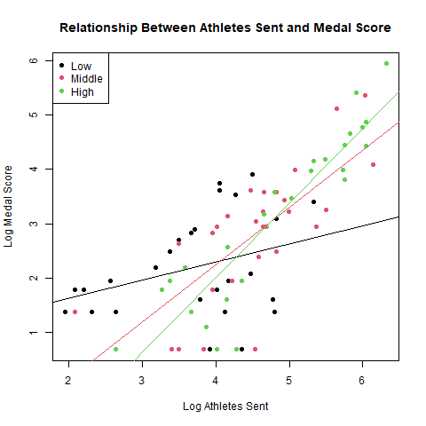

# Olympic Data Analysis
Regression analysis of Olympic medal performance using socio-economic data from the 2016 Rio Games

---

## Overview

This project investigates the factors influencing Olympic success across countries. A weighted medal score (Gold = 5, Silver = 3, Bronze = 1) is used as the response variable.

The analysis explores how variables such as:
- number of athletes sent
- income level
- population
- education
- health indicators  

relate to Olympic performance.

---

## Key Findings

- The number of athletes sent is the strongest predictor of Olympic success.
- There is a clear interaction with income level:
  - High-income countries convert participation into medals more effectively
  - Low-income countries see weaker returns from increased participation
- The final model explains approximately 62% of the variation in medal performance (Adjusted R² ≈ 0.623)

---

## Example Visualisation

Relationship between number of athletes sent and medal performance, segmented by income group:

---

## Methodology

The analysis follows a structured statistical workflow:

1. Data collection from Olympic results, World Bank, and UNDP sources  
2. Data cleaning and preprocessing, including handling missing values and applying log transformations  
3. Exploratory data analysis to understand distributions and relationships  
4. Linear regression modelling with interaction terms  
5. Model refinement and diagnostic checks  

---

## Final Model

The final regression model is:

log(medal_score) ~ log(athletes_sent) * income_group

where income_group is treated as a categorical variable

This captures both:
- the direct effect of participation  
- how efficiency differs across income levels  

---

## Limitations

- Based on one Olympic year (2016), limiting generalisability  
- Uses country-level data and does not capture sport-specific effects  
- Education spending is used as a proxy for sports investment  
- Model not validated on external data  

---

## Repository Structure

- data/
  - Raw dataset
- src/
  - R analysis script
- README.md
  - Project overview

---

## How to Run

1. Clone or download the repository
2. Open the project folder in R
3. Ensure the working directory is set to the project root
4. Run `src/olympic_analysis.R` to reproduce the analysis  

---

## Tech Stack

- R
- Linear regression
- Data visualisation

---

## Summary

This project demonstrates how socio-economic factors influence Olympic performance, highlighting the role of resources and scale in driving success.
